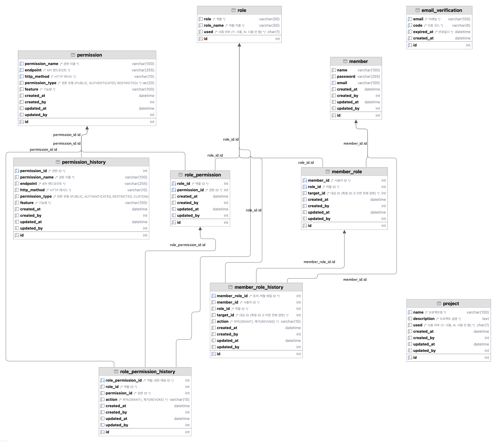

# 프로젝트 관리 API

## 개발환경
- FastAPI
- MySQL

## 프로젝트 실행
- 서버 실행을 위해 .env 파일 임시 gitignore 제외
- docker-compose 실행시 DB, API 서버 자동 실행
  - DB 초기화를 위해 docker-compose 실행시 initdb.d 폴더 내 sql 파일 실행
  - 테이블 생성 및 초기 데이터 삽입 (유저, 권한, 역할)

- Swagger UI
  - http://localhost:8000/docs

## 테이블 구조
- [테이블 생성 쿼리](./docker/db-mysql/initdb.d/2.create_table.sql) 참고

### DB ERD

- **권한 관리**
  - **권한** (Permission), 역할(Role) 로 관리
  - **권한**: endpoint 기준으로 기능별 권한 설정
    - **권한 타입 permission type**
      - public: 인증 없이 누구나 접근 가능 
      - authenticated: 로그인한 사용자만 접근 가능 
      - restricted: 특정 대상만 접근 가능
  - **역할**: 권한의 그룹이 되는 역할 설정
    - **역할 타입 role type**
      - admin: 관리자
      - project_owner: 프로젝트 소유자
      - editor: 편집자
      - viewer: 조회자

### 권한 검증 방식
- middleware로 endpoint 접근 권한 검증
- 추가 고려 사항
  - 유저 로그인 혹은 토근 갱신시 권한 정보 Redis 등 캐싱 처리하여 디비 부하 최소화
